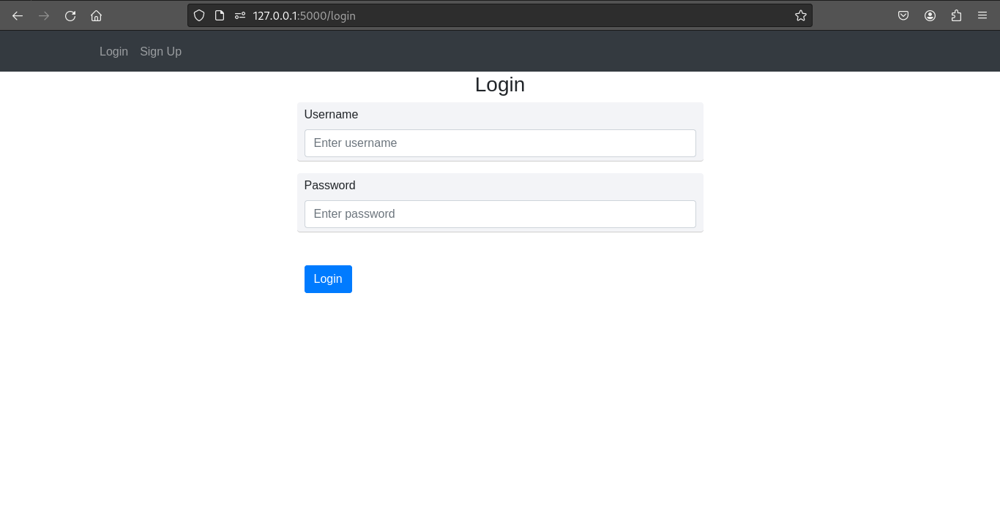
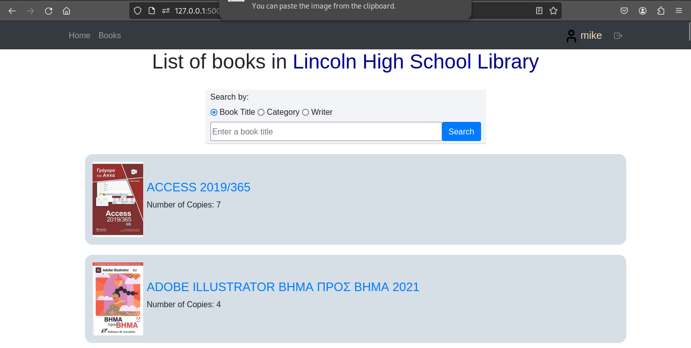
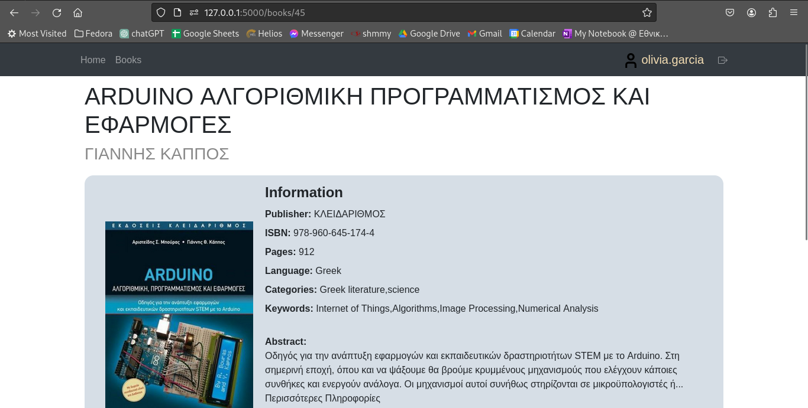
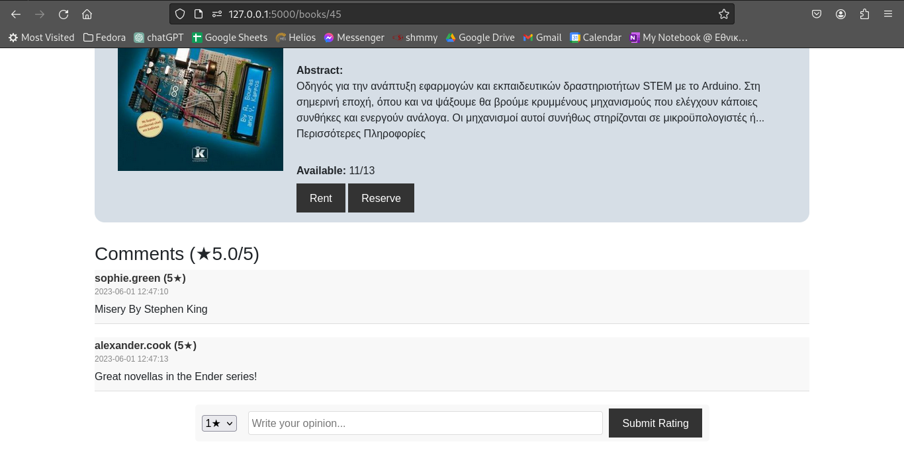

# School Library

This is a full stack website project. We created a library network
that allows users to rent or reserve books out of a database of books.
It has login and signup capabilities. You can also rate and comment on the titles available for you.

Most of the data was generated randomly and the books where scrapped from
a website.

## Stack

-Python
-Jupyter
-Flask
-MySQL
-XAMPP
-CSS
-Javascript

## Installation

Install [MySQL Server](https://dev.mysql.com/downloads/mysql/) and [XAMPP](https://www.apachefriends.org/)

Use the package manager [pip](https://pip.pypa.io/en/stable/) to install all packages.

```bash
pip3 install flask,flask_login,flask_mysqldb,mysql,mysql.connector,werkzeug 
```

Clone our repository.

```bash
git clone https://github.com/Se7enBit/DatabasesProject.git
```

Open a terminal and start a MySQL Server instance.
Source the run.sql file on the running instance.

```bash
source SQL_code/new_and_improved/run.sql;
```

This initializes the database with all insertions.

Now on the root directory of the file try you can run main.py
 
```bash
python3 main.py
```

## User Manual

Each user of the application has the ability to login or sign up for the application.




### Student or Teacher

As a student or teacher you can rent or reserve books that are shown in the catalog.



Once you've picked a book that you like, you're redirected to the book's home page where
you can rent or reserve it, view more information on it, comment and rate it.





Finally you can view your rentals and reservations from your main page.


### School Admin

As a School Administrator you can publish comments that the users post, allow for rentals or reservations
and also activate or deactive users. You will also be notified if a user hasn't returned a book on time.


