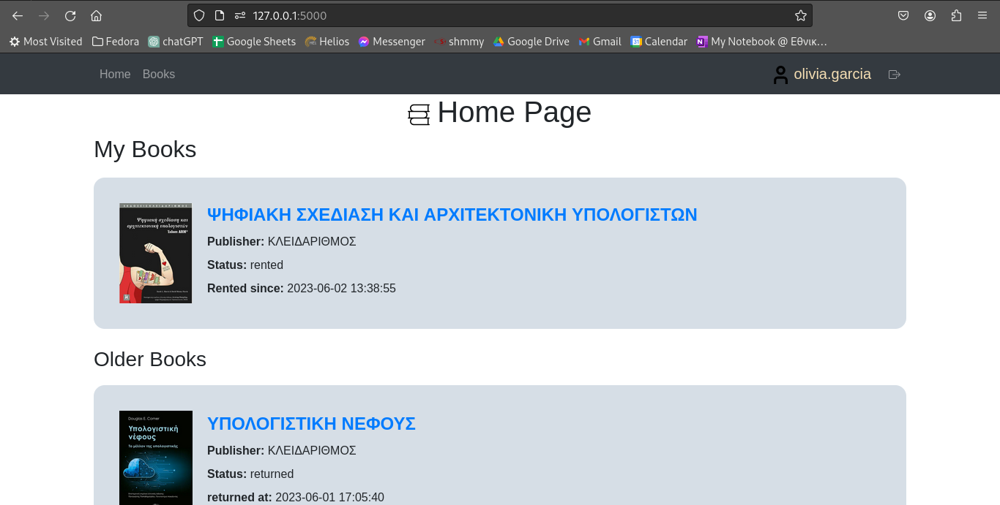
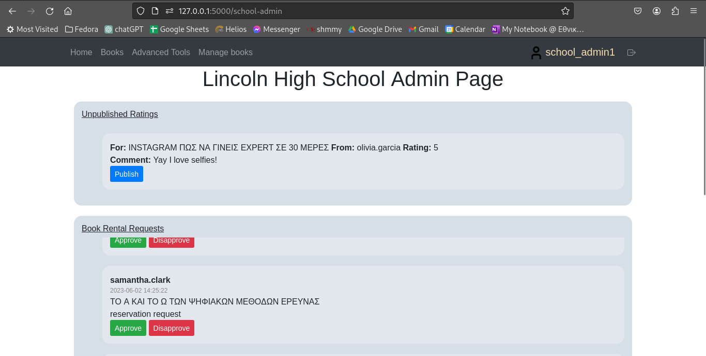
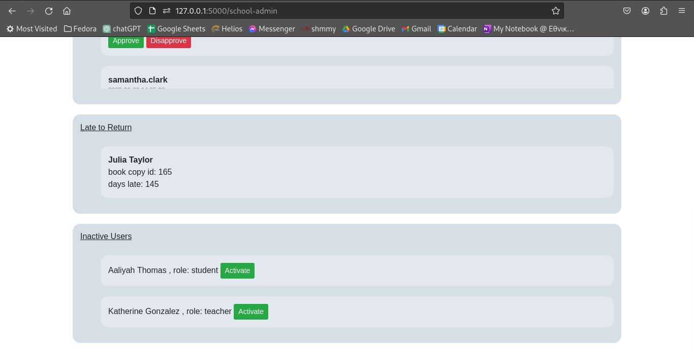

# DatabasesProject

Databases Semester Project

Finally you can view your rentals and reservations from your main page.

redirect(url_for("views.home")) is used to redirect the user to a different page in your Flask application. When the user accesses the page containing this code, they will be immediately redirected to the specified page, which in this case is the home view function in the views module. This is useful when you want to force the user to go to a different page, for example after they have submitted a form or when they are not authorized to access a certain page.

As a School Administrator you can publish comments that the users post, allow for rentals or reservations
and also activate or deactive users. You will also be notified if a user hasn't returned a book on time.

